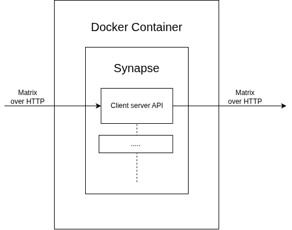
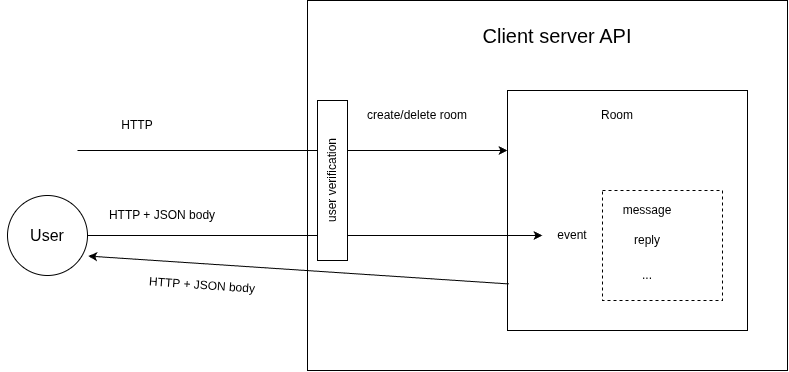

# Assignment 1
---
- Robin Brevink
- Bas Schram
- Dirk van Roosmalen
- Kars Visscher
---
# Test Preparation
## Exercise 1: Description of SUT
Our system-under-test is [Synapse](https://github.com/element-hq/synapse), a (home)server developed by [Element](https://element.io/). Synapse is an open source instance of [Matrix](https://matrix.org/) written in Python.

Using Synapse, the user can locally run a chat server and connect to it using a web client on [app.element.io](https://app.element.io/). These enable communication in accordance with the Matrix communication protocol.

As a chat server, Synapse allows a user to communicate with it and other users by following the Matrix protocol. 
- Functionality includes user registration and login, creating/joining/leaving chatrooms, sending and receiving messages and viewing message history. 
- The interface is the Matrix Client-Server HTTP API exposed by Synapse at `/_matrix/client/*` on `localhost:8008`, accessed either through a GUI at `app.element.io` or directly via HTTP requests.
- The inputs include user credentials (registration/login), room actions (create, join, invite), and messages, entered through the `app.element.io` UI or sent as JSON in HTTP requests.
- The outputs consist of room - and message data rendered in the `app.element.io` UI, or viewed as raw JSON responses and HTTP status codes when interacting with the API directly.
- Synapse runs in a Docker container built from source on the tester's machine. Element runs as a web client in a browser, connecting to the local Synapse instance over HTTP.
- The server is started with `docker run` (built beforehand with `docker build`) and stopped with `docker stop`/`docker rm`; the client is simply opened/closed in a browser tab, with the homeserver URL matching that of port exposed by Docker (see [README.md](https://github.com/kjvisscher/TestingTechniques1/blob/main/README.md)).

For black-box testing the SUT's internal structure, we mainly focus on the components which have an observable form of output:
- HTTP Listener on port `8008` passing request based on content and path.
- Client-server and API handler process requests in accordance with the Matrix communication protocol.




The latest version of the Synapse repository ([1.161.0](https://github.com/element-hq/synapse/releases/tag/v1.161.0)) is ran using a docker container on the [latest image version](https://hub.docker.com/r/matrixdotorg/synapse). The repository and image are both run locally on either Linux or Windows operating systems. A basic setup procedure is required before running Synapse for the first time, as detailed in `TestingTechniques1/README.md`.

References to relevant documentation:
- Element home page: https://element.io/
- Matrix home page: https://matrix.org/
- Matrix documentation: https://matrix.org/docs/
- Latest Matrix API: https://spec.matrix.org/latest/
- Used Synapse image: https://hub.docker.com/r/matrixdotorg/synapse/
- Public Synapse repository: https://github.com/element-hq/synapse/
- Synapse documentation: https://docs.element.io/latest/
## Exercise 2: What part of Synapse to test
We're going to test sending a message into a chatroom. By recreating chatrooms, we can create identical test conditions without needing to reset the container between runs. We intend to test the part dealing with chatting in a room primairly from the perspective of the user interaction that happens on the server. This means we need to test the components dealing with client-server API and room events. We intend to test sending messages by varying the input parameters:
1. Url with method
2. Headers (authentication)
3. The message body:
	1. Message content (`body`)
	2. Message type  (`msgtype`)
	3. Sender (`sender`)

The interface utilized during testing is the client-server API. Relevant documentation can be found in the [Matrix specification](https://spec.matrix.org/v1.19/client-server-api/). Refer to the following chapters:

| Feature             | Relevant Chapter                                                                         |
| ------------------- | ---------------------------------------------------------------------------------------- |
| Errors              | [Chapter 1.1](https://spec.matrix.org/v1.19/client-server-api/#standard-error-response)  |
| Logging in          | [Chapter 4.3](https://spec.matrix.org/v1.19/client-server-api/#login)                    |
| Sending room events | [Chapter 7.7](https://spec.matrix.org/v1.19/client-server-api/#sending-events-to-a-room) |
| Creating a room     | [Chapter 8.2](https://spec.matrix.org/v1.19/client-server-api/#creation)                 |
| Sending a message   | [Chapter 10.2](https://spec.matrix.org/v1.19/client-server-api/#instant-messaging)       |
## Exercise 3: Test architecture for the testing
Illustrated below is a hybrid high level component view and class diagram of our testing application in relation to the SUT. We have decided to picture Synapse as a black box, as all test cases are communicated over the same protocol and are handled in the same interface.


The test will be run by an automatic testing application, this application will have multiple test suits which will all test a specific group of tests. Each test suite can contain multiple test cases. Each test case will consist of a unit test like assertion. Each test case will contain a HTTP-request which will be sent to the SUT, after which the response will be compared to the "expected behavior" response and making the test either pass or fail.

The output of the SUT will be in compliance with the matrix communication protocol over HTTP-requests. The output will consist of text-based messages or files. The primary focus of the tests will be text-based messages because the comparison is simpler to assert. These responses are analyzed by the testing application.

We make the following assumptions about Synapse:
1. By recreating rooms for each test, the behavior of messages is consistent throughout.
2. The behavior of Synapse is identical whether it is run locally or when running on a public server. That is, the test results achieved from running Synapse as a standalone Docker image are assumed to match those achieved from testing a "real" installation connected to multiple other servers over the internet.
3. Rate limits are assumed not to hinder running any automated tests.
4. Actual outputs of Synapse match those described in the [Matrix documentation](https://matrix.org/docs/). 

The primary testing tool used for this project is a unit testing framework for C called *Check* by Arien Malec (see [repository](https://github.com/libcheck/check)). 
## Exercise 4: What typical test cases look like
The initial state for most of our tests is to have a chat room with one user, with possible additional constraints depending on the test. Test input and output are plain text JSON objects transmitted over HTTP. Test input requires some sort of event (such as sending a message, replying to a message, etc.) as input alongside additional required parameters as specified by the Matrix API. Test output will include a HTTP status code, alongside a body which includes plain text information or possible errors. We can observe whether a test has succeeded by comparing the received response with an expected response and asserting that:
1. The returned HTTP status code matches what is expected   
2. The body of the returned response is not empty
3. (For success) The body of the returned response contains an event ID/room ID
4. (For failure) The body of the returned response contains a specified error code

Our test cases are based on so called *room events*. Creating a room is done using a POST request. A room event consists out of either a GET request for requesting information from the server, or a PUT request for sending events to the server. All of the tested requests require the user to be authenticated by including their token in an *Authorization* header in the request, which won't explicitly be included for each test case. Furthermore, since each room event requires a `roomID` of the current room (which is randomly generated for each test), the test cases will not explicitly mention this value. However remember this will always be an implicit URL parameter in the HTTP request. If the *Test Conditions* column for a given test is empty, 'normal' (otherwise succeeding) conditions are assumed. Below is an example of how two distinct types of requests will be noted:

| Type | Request                                  | JSON<br>Parameters                   | Test<br>Conditions  | Expected<br>Status<br>Code | Expected<br>Body/<br>Error |
| ---- | ---------------------------------------- | ------------------------------------ | ------------------- | -------------------------- | -------------------------- |
| POST | createRoom                               | "name": "Test room"                  | -                   | 200                        | Room_ID                    |
| PUT  | rooms/{roomID}/state/<br>m.room.message/ | body : "Test" <br>msgtype : "m.text" | User is not in room | 403                        | M_FORBIDDEN                |

## Exercise 5: Description implemented test architecture
The tests trigger the SUT through the Matrix Client-Server HTTP API at `http://localhost:8008/_matrix/client/v3/*`. Each test case builds an HTTP request (method, path, headers, JSON body) and sends it. Requests that need authentication carry an `Authorization: Bearer <access_token>` header. Examples of the endpoints used:
- `POST /_matrix/client/v3/createRoom`
	- (create a fresh room per test)
- `PUT /_matrix/client/v3/rooms/{roomId}/state/m.room.message`
	- (send a message)

The test code reads two things from every response: the HTTP status code and the JSON body. Assertions are made on fields such as `event_id`, `errcode`, `error`, and the `content.body` and `m.relates_to` of events returned by `/messages`.

The test driver is a C program using the Check library. Tests are grouped in suites (based on functionalities like sending, deleting, replying). A small helper library wraps libcurl for sending the HTTP requests and cJSON for building and parsing the JSON bodies. The helpers hide details such as headers, authentication and transaction IDs, so the test cases themselves stay short.

No stubs or mocks are used, as the tests run against the real Synapse server in Docker. The second user in a room is simulated by the driver with a second access token, so no real client is needed. The Element web client is not part of the automated tests.

Additional tools or implementation details:
  - Two test users are registered once before the tests with `register_new_matrix_user` inside the container. Their access tokens are retrieved through `POST /_matrix/client/v3/login`.
  - A Check fixture (`setup`) creates a fresh room before each test and invites and joins the second user. This gives every test the same initial state without resetting the container.
  - Matrix requires a unique transaction ID (`txnId`) for each `PUT` request, so the helpers generate a new counter-based ID per request.

Docker publishes port `8008` to the host, so the Client-Server API is reachable by the test application. This is the only interface the tests use. The internal components of Synapse (HTTP listener, API handlers, database) are not accessed directly (in line with black-box testing) their behaviour is observed only through the API responses.

# Test Development
## Exercise 6: Domains, inputs and interfaces
The interface used is the client server API through HTTP requests and our formatting functions. Constant and unrelated variables are omitted, since these typically apply to all room events which fall outside the scope of our testing. These domains assume that the HTTP requests are valid. Additionally, given that message sending is a room event, it is required to specify which room to send the event to. This is done by passing the `Room_ID` in as a string.

| Datatype                 | Contents                                                |
| ------------------------ | ------------------------------------------------------- |
| e(200 : OK)              | Event_ID                                                |
| r(200 : OK)              | Room_ID                                                 |
| 400 : Bad Request        | "M_UNKNOWN", "{key} not in content"                     |
| 400 : Bad Request        | "M_NOT_JSON", "Content not JSON."                       |
| 401 : Unauthorized       | "M_UNKNOWN_TOKEN", "Invalid access token passed"        |
| 401 : Unauthorized       | "M_MISSING_TOKEN", "Missing access token"               |
| 403 : Forbidden          | "M_FORBIDDEN", "User @{username} not in room {Room_ID}" |
| 404 : Not Found          | "M_UNRECOGNIZED", "Unrecognized request"                |
| 405 : Method Not Allowed | "M_UNRECOGNIZED", "Unrecognized request"                |
## Exercise 7: Black-box functionality test cases
Test case identification is based on the following convention: ID = suite_number.test_number. Where:
1. Suite 1: Room tests
2. Suite 2: Message tests
### Basic Tests

| ID  | Type | Request                                  | JSON<br>Parameters                     | Test<br>Conditions | Expected<br>Status<br>Code | Expected<br>Body |
| --- | ---- | ---------------------------------------- | -------------------------------------- | ------------------ | -------------------------- | ---------------- |
| 1.1 | POST | create_room                              | name : "My test room"                  | -                  | 200                        | Room_ID          |
| 2.1 | PUT  | rooms/{roomID}/state/<br>m.room.message/ | body : "Test", <br> msgtype : "m.text" | -                  | 200                        | Event_ID         |

### Bad Token

| ID  | Type | Request                                  | JSON<br>Parameters                     | Test<br>Conditions | Expected<br>Status<br>Code | Expected<br>Body |
| --- | ---- | ---------------------------------------- | -------------------------------------- | ------------------ | -------------------------- | ---------------- |
| 2.2 | PUT  | rooms/{roomID}/state/<br>m.room.message/ | body : "Test", <br> msgtype : "m.text" | Invalid Auth Token | 401                        | M_UNKNOWN_TOKEN  |
| 2.3 | PUT  | rooms/{roomID}/state/<br>m.room.message/ | body : "Test", <br> msgtype : "m.text" | No Auth Token      | 401                        | M_MISSING_TOKEN  |

### Bad HTTP Request

| ID  | Type | Request                                  | JSON<br>Parameters                     | Test<br>Conditions | Expected<br>Status<br>Code | Expected<br>Body |
| --- | ---- | ---------------------------------------- | -------------------------------------- | ------------------ | -------------------------- | ---------------- |
| 2.4 | PUT  | rooms/{roomID}/state/<br>m.room.message/ | body : "Test", <br> msgtype : "m.text" | Bad HTTP Endpoint  | 404                        | M_UNRECOGNIZED   |
| 2.5 | POST | rooms/{roomID}/state/<br>m.room.message/ | body : "Test", <br> msgtype : "m.text" | Wrong HTTP Method  | 405                        | M_UNRECOGNIZED   |


### JSON Body

| ID  | Type | Request                                  | JSON<br>Parameters                               | Test<br>Conditions    | Expected<br>Status<br>Code | Expected<br>Body |
| --- | ---- | ---------------------------------------- | ------------------------------------------------ | --------------------- | -------------------------- | ---------------- |
| 2.6 | PUT  | rooms/{roomID}/state/<br>m.room.message/ | body : "", <br> msgtype : "m.text"               | Empty Body            | 200                        | Event_ID         |
| 2.7 | PUT  | rooms/{roomID}/state/<br>m.room.message/ | body : "Test", <br> msgtype : "m.does_not_exist" | Invalid msgtype       | 200                        | Event_ID         |
| 2.8 | PUT  | rooms/{roomID}/state/<br>m.room.message/ | body : "Test",                                   | No msgtype            | 400                        | M_NOT_JSON       |
| 2.9 | PUT  | rooms/{roomID}/state/<br>m.room.message/ | body : 12345,  <br> msgtype : "m.text"           | Body field as integer | 400                        | M_BAD_JSON       |


### No Permission

| ID   | Type | Request                                  | JSON<br>Parameters                     | Test<br>Conditions         | Expected<br>Status<br>Code | Expected<br>Body |
| ---- | ---- | ---------------------------------------- | -------------------------------------- | -------------------------- | -------------------------- | ---------------- |
| 2.10 | PUT  | rooms/{roomID}/state/<br>m.room.message/ | body : "Test", <br> msgtype : "m.text" | Room doesn't exist         | 403                        | M_FORBIDDEN      |
| 2.11 | PUT  | rooms/{roomID}/state/<br>m.room.message/ | body : "Test", <br> msgtype : "m.text" | Sender doesn't match token | 200                        | Event_ID         |
# Test Execution
## Exercise 8: Testing the SUT
As described [[#Exercise 4 What typical test cases look like|earlier]], we're using an automated test application to run these tests. If any of the assertions in this test fail, the testcase will too. The results are as follows:
### Room creation  
```c  
Running suite(s): Room Test Suite  
100%: Checks: 1, Failures: 0, Errors: 0  
P:Room Creation Test Case:test_room_create:0: Passed  
```  
  
### Send message  
```c  
Running suite(s): Message Test Suite
100%: Checks: 11, Failures: 0, Errors: 0
P:Message Send Test Case:test_message_send:0: Passed
P:Message Send Test Case:test_message_send_bad_token:0: Passed
P:Message Send Test Case:test_message_send_no_token:0: Passed
P:Message Send Test Case:test_message_send_bad_endpoint:0: Passed
P:Message Send Test Case:test_message_send_wrong_method:0: Passed
P:Message Send Test Case:test_message_send_empty_message:0: Passed
P:Message Send Test Case:test_message_send_wrong_type:0: Passed
P:Message Send Test Case:test_message_send_invalid_sender:0: Passed
P:Message Send Test Case:test_message_send_invalid_json:0: Passed
P:Message Send Test Case:test_message_send_unknown_msgtype:0: Passed
P:Message Send Test Case:test_message_send_unknown_room:0: Passed
```
## Exercise 9: Analysis and explanation
The tests for all 12 formulated test cases passed, implying that the asserted values for each test match what we expect.

| Test suite    | Tests passed | Test errors |
| ------------- | ------------ | ----------- |
| Room creation | 1/1          | 0           |
| Send message  | 11/11        | 0           |
| **Total**     | 12/12        | 0           |
## Exercise 10: Test tools
The code for our test application can be found in our public [GitHub repository](https://github.com/kjvisscher/TestingTechniques1). For instructions on how to run it, see [README.md](https://github.com/kjvisscher/TestingTechniques1/blob/main/README.md). The first part of it contains a guide on how to get Synapse running in a Docker, written by us. The second part is an edited version of the *README* from an open sourced example project for Check, see [cmake-example](https://github.com/vndmtrx/check-cmake-example). Note that Valgrind is not required to run the app. Before running, change the constants in `tests/test_room.c` and `tests/test_message.c` to match the admin's username and password for the local synapse installation (which in our testing were both "dirk"). Additional information about how the requests are performed (and how to mimick them) are provided in `assignment/requests.md`.