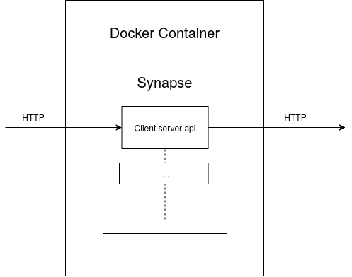
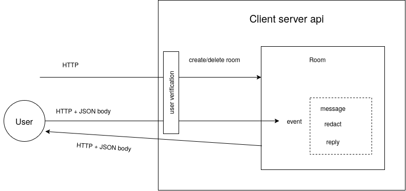
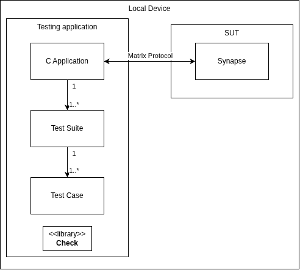

# Test Preparation
## Exercise 1: Description of SUT
For our system-under-test we have picked [Synapse](https://github.com/element-hq/synapse) a (home)server developed by [Element](https://element.io/). Synapse is an open source instance of [Matrix](https://matrix.org/) written in Python.

Using Synapse, the user can locally run the server and connect to it using a web client on [app.element.io](https://app.element.io/). These enable chat-based communication in accordance with the Matrix communication protocol.

As a chat server, Synapse allows a user to communicate following the Matrix protocol. 
- Functionality includes user registration and login, creating/joining/leaving rooms, sending and receiving messages and viewing message history. 
- The interface is the Matrix Client-Server HTTP API exposed by Synapse at `/_matrix/client/*` on `localhost:8008`, accessed either through `app.element.io` or directly via HTTP requests.
- The inputs include user credentials (registration/login), room actions (create, join, invite), and messages, entered through the `app.element.io` GUI or sent as plaintext JSON in HTTP requests.
- The outputs consist of rooms and messages rendered in the `app.element.io` UI, or viewed as raw JSON responses and HTTP status codes when interacting with the API directly.
- Synapse runs in a Docker container built from source on the tester's machine. Element runs as a web client in a browser, connecting to the local Synapse instance over HTTP.
- The server is started with `docker run` (built beforehand with `docker build`) and stopped with `docker stop`/`docker rm`; the client is simply opened/closed in a browser tab, with the homeserver URL matching that of port exposed by Docker (see [[TestingTechniques1/README]]).

For black-box testing the SUT's internal structure, we mainly focus on the components which have an observable form of output:
- HTTP Listener on port `8008` passing request based on content and path.
- Client-server and API handler process requests in accordance with the Matrix communication protocol.

The latest version of the Synapse repository ([1.161.0](https://github.com/element-hq/synapse/releases/tag/v1.161.0)) is running as a docker container on the [latest image version](https://hub.docker.com/r/matrixdotorg/synapse). The repository and image are both run locally on either Linux or Windows operating systems. A basic setup procedure is required before running Synapse for the first time, as detailed in [[TestingTechniques1/README]].

References to relevant documentation:
- Element home page: https://element.io/
- Matrix home page: https://matrix.org/
- Matrix documentation: https://matrix.org/docs/
- Latest Matrix API: https://spec.matrix.org/latest/
- Used Synapse image: https://hub.docker.com/r/matrixdotorg/synapse/
- Public Synapse repository: https://github.com/element-hq/synapse/
## Exercise 2: What part of Synapse to test
We're going to test sending a message into a chatroom. By recreating chatrooms, we can create identical test conditions without needing to reset the container between runs. We intend to test the part dealing with chatting in a room primairly from the perspective of the user interaction that happens on the server. This means we need to test the components dealing with client-server API and room events. 
We intend to test sending messages by varying the input parameters:
1. Url with method
2. Headers focusing on authentication
3. The message body:
   1. Name
   2. User
   3. Content

The interface utilized during testing will be the client-server API. Relevant documentation can be found in the [Matrix specification](https://spec.matrix.org/v1.19/client-server-api/). Refer to the following chapters:

| Feature               | Relevant Chapter                                                                        |
| --------------------- | --------------------------------------------------------------------------------------- |
| Errors                | [Chapter 1.1](https://spec.matrix.org/v1.19/client-server-api/#standard-error-response) |
| Room events           | [Chapter 7](https://spec.matrix.org/v1.19/client-server-api/#events)                    |          |          |
| Sending a message     | [Chapter 10.2](https://spec.matrix.org/v1.19/client-server-api/#instant-messaging)      |

## Exercise 3: Test architecture for the testing
Illustrated below is a hybrid high level component view and class diagram of our testing application in relation to the SUT. We have decided to picture Synapse as a black box, as all test cases are communicated over the same protocol and are handled in the same interface.

The test will be run by an automatic testing application, this application will have multiple test suits which will all test a specific group of tests. Each test suite will contain multiple test cases. Each test case will consist of a unit test like assertion. Each test case will consist of a HTTP-request which will be sent to the SUT, after which the response will be compared to the "expected behavior" response and making the test either pass or fail.

The output of the SUT will be in compliance with the matrix communication protocol over HTTP-requests. The output will consist of text-based messages or files. The primary focus of the tests will be text-based messages because the comparison is simpler to assert. These responses are analyzed by the testing application.

We make the following assumptions about Synapse:
1. By recreating rooms for each test, the behavior of messages is consistent throughout.
2. The behavior of Synapse is identical whether it is run locally or when running on a public server. That is, the test results for achieved from running Synapse as a standalone Docker image are assumed to match those achieved from testing a "real" installation connected to multiple other servers over the internet.

The primary testing tool used for this project is a unit testing framework for C called *Check* by Arien Malec (see [repository](https://github.com/libcheck/check)). 
## Exercise 4: What typical test cases look like
The initial state for our tests will be a chat room with one users, with possibly extra requirements depending on the test. Test input and output are plain text JSON objects transmitted over HTTP. Test input requires some sort of event (such as sending a message, replying to a message, etc.) as input alongside additional required parameters as specified by the Matrix API or the synapse api. If these 2 conflict we priorize the second and we will document it. Test output will include a HTTP status code depending on the success of the request, alongside a body which includes plain text information or possible errors. We can observe whether a test has succeeded by comparing the received response with an expected response and asserting that:
1. The HTTP status codes match
2. Relevant fields in the JSON body (i.e. message content) match.

Our test cases are based on so called *room events*. A room event consists out of either a GET request for requesting information from the server, or a PUT request for sending events to the room. Since each room event requires the `roomID` of the current room, which we won't test on, the test cases will not explicitly mention this value. However remember this will always be an implicit parameter in the HTTP request. The two distinct types of requests will be noted in the following way:

| Type | Request               | JSON Parameters                     | Extra Conditions     | Expected Status Code | Expected Body/Error|
|------|-----------------------|-------------------------------------|----------------------|----------------------|--------------------|
| GET  | joined_members        |                                     |                      | 200                  | Map to RoomMembers |
| PUT  | m.room.message        | body : "Hi"   msgtype : "m.text" | Not in room          | 403                  | M_FORBIDDEN        |

Our few tests to test the creation of a room are discribed in the same way.

## Exercise 5: Description implemented test architecture
The tests trigger the SUT through the Matrix Client-Server HTTP API at `http://localhost:8008/_matrix/client/v3/...`. Each test case builds an HTTP request (method, path, headers, JSON body) and sends it. Requests that need authentication carry an `Authorization: Bearer <access_token>` header. Examples of the endpoints used:
- `POST /_matrix/client/v3/createRoom`
  - (create a fresh room per test)
- `POST /_matrix/client/v3/rooms/{roomId}`
  - (add the second user)
- `PUT /_matrix/client/v3/rooms/{roomId}/send/...`
  - (send a message or reply)
- `PUT /_matrix/client/v3/rooms/{roomId}/redact/...`
  - (delete a message)
- `GET /_matrix/client/v3/rooms/{roomId}/messages/...`
  - (read message history)

Output interface: The test code reads two things from every response: the HTTP status code and the JSON body. Assertions are made on fields such as `event_id`, `errcode`, `error`, and the `content.body` and `m.relates_to` of events returned by `/messages`.

- b) implementation of stubs, drivers, used test tools;

The test driver is a C program using the Check library. Tests are grouped in suites (based on functionalities like sending, deleting, replying). A small helper library wraps libcurl for sending the HTTP requests and cJSON for building and parsing the JSON bodies. The helpers hide details such as headers, authentication and transaction IDs, so the test cases themselves stay short.

No stubs or mocks are used, as the tests run against the real Synapse server in Docker. The second user in a room is simulated by the driver with a second access token, so no real client is needed. The Element web client is not part of the automated tests.

- c) any additional tools or implementation details that are necessary;
  - Two test users are registered once before the tests with `register_new_matrix_user` inside the container. Their access tokens are retrieved through `POST /_matrix/client/v3/login`.
  - A Check fixture (`setup`) creates a fresh room before each test and invites and joins the second user. This gives every test the same initial state without resetting the container.
  - Matrix requires a unique transaction ID (`txnId`) for each `PUT` request, so the helpers generate a new counter-based ID per request.

- d) are all test interfaces in the architecture accessible?

Yes. Docker publishes port `8008` to the host, so the Client-Server API is reachable by the test application. This is the only interface the tests use. The internal components of Synapse (HTTP listener, API handlers, database) are not accessed directly (in line with black-box testing) their behaviour is observed only through the API responses.

# Test Development
## Exercise 6: Domains, inputs and interfaces
The interface is in all cases the client server api trough HTTP and our formatting functions.
constanst and unrelated variables are mosly omitted, these typicaly apply to all room events which fall outside the scope of our testing. Optional was used to give an optional argument. These domains assume that the HTTP requests are valid. additionaly as messages are room events you need to specify to which room you send a event. This is done by a room id(String).

| datatype                | details                         |
|-------------------------|---------------------------------|
| String                  | sequence of unicode characters  |
| e(200:succeeded)         | contains event id               |
| r(200:succeeded)         | contains room id               |
| (400:formatting errors) | error code and an error message |
| (403:no permission)     | error code and an error message |
| (404:not found)         | error code and an error message |
| (405:unrecognized)      | error code and an error message |

| test           | input                                           | output                                                   | other                                    |
|----------------|-------------------------------------------------|----------------------------------------------------------|------------------------------------------|
| send message   | body(String) and optional(sender(String)) and msgtype(String)                                  | e(200:succeeded) Xor (400:failed) Xor (403:no permission) Xor (404:not found) Xor (405:unrecognized) | msgtype is set to m.txt if nonsence is entered                  |
| create room | name(String) | r(200:succeeded)|there are lot of unused optional parameters for this|

## Exercise 7: Black-box functionality test cases
Develop (at least) 12 black-box functionality test cases to test your sut and write them in your test notation. Motivate your choice for these test cases, and make clear which test generation technique you used for each test (EP, BVA, state-based, use-case, . . . ).

1. Create room (without alias)
2. Sending a message
3. Sending a message (bad authentication token)
4. Sending a message (missing authentication header)
5. Sending a message (bad endpoint)
6. Sending a message (wrong HTTP method)
7. Sending a message (empty body)
8. Sending a message (non-existant message type)
9. Sending a message (wrong JSON field type)
10. Sending a message (invalid JSON)
11. Sending a message (Room doesn't exists)
12. Sending a message (Sender doesn't match token)

### Basic Tests
| Type | Request               | JSON Parameters                        | Test Conditions  | Expected Status Code | Expected Body      |
|------|-----------------------|----------------------------------------|------------------|----------------------|--------------------|
| POST | create_room           | name : "My test room"                  |                  | 200                  | Room_ID            |
| PUT  | m.room.message        | body : "Test",   msgtype : "m.text" |                  | 200                  | Event_ID           |

### Bad Token Tests
| Type | Request               | JSON Parameters                        | Test Conditions  | Expected Status Code | Expected Body      |
|------|-----------------------|----------------------------------------|------------------|----------------------|--------------------|
| PUT  | m.room.message        | body : "Test",   msgtype : "m.text" | Bad Auth Token   | 401                  | M_UNKNOWN_TOKEN    |
| PUT  | m.room.message        | body : "Test",   msgtype : "m.text" | No Auth Token    | 401                  | M_MISSING_TOKEN    |

### Bad HTTP Request Tests
| Type | Request               | JSON Parameters                        | Test Conditions  | Expected Status Code | Expected Body      |
|------|-----------------------|----------------------------------------|------------------|----------------------|--------------------|
| PUT  | m.room.message        | body : "Test",   msgtype : "m.text" | Bad HTTP Endpoint | 404                 | M_UNRECOGNIZED     |
| POST | m.room.message        | body : "Test",   msgtype : "m.text" | Wrong HTTP Method | 405                 | M_UNRECOGNIZED     |

### JSON Body Tests
| Type | Request               | JSON Parameters                        | Test Conditions  | Expected Status Code | Expected Body      |
|------|-----------------------|----------------------------------------|------------------|----------------------|--------------------|
| PUT  | m.room.message        | body :       ,   msgtype : "m.text" | Empty Body       | 200                  | Event_ID           |
| PUT  | m.room.message        | body : "Test",   msgtype : "m.does_not_exist"   | Invalid msgtype  | 200                  | Event_ID           |
| PUT  | m.room.message        | body : 12345,    msgtype : "m.text" | Bad JSON Field   | 400                  | M_BAD_JSON         |
| PUT  | m.room.message        | body : "Test",                         | Invalid JSON     | 400                  | M_NOT_JSON         |

### No Permission Tests
| Type | Request               | JSON Parameters                        | Test Conditions    | Expected Status Code | Expected Body    |
|------|-----------------------|----------------------------------------|--------------------|----------------------|------------------|
| PUT  | m.room.message        | body : "Test",   msgtype : "m.text" | Room doesn't exist | 403                  | M_FORBIDDEN      |
| PUT  | m.room.message        | body : "Test",   msgtype : "m.text" | Sender doesn't match token | 403                  | M_FORBIDDEN      |

# Test Execution
## Exercise 8: Testing the SUT
Test your sut with the developed test cases, either manually, or using some existing or self-developed test execution tool. Describe for each test case the outcome of test execution.
## Exercise 9: Analysation and explanation
Analyze and explain the observed test results.
## Exercise 10: Test tools
Here we have a link to our git repo: https://github.com/kjvisscher/TestingTechniques1. For instructions on how to run it see the readme. Note that an docker installation is required with synapse running on it as described there. In additon a c++ installation with cmake and Check installed is needed. Valgrind is not needed for our code to work despite it being discribed in the readme. We require the username to be user and the password to be user for the automatic authenication.